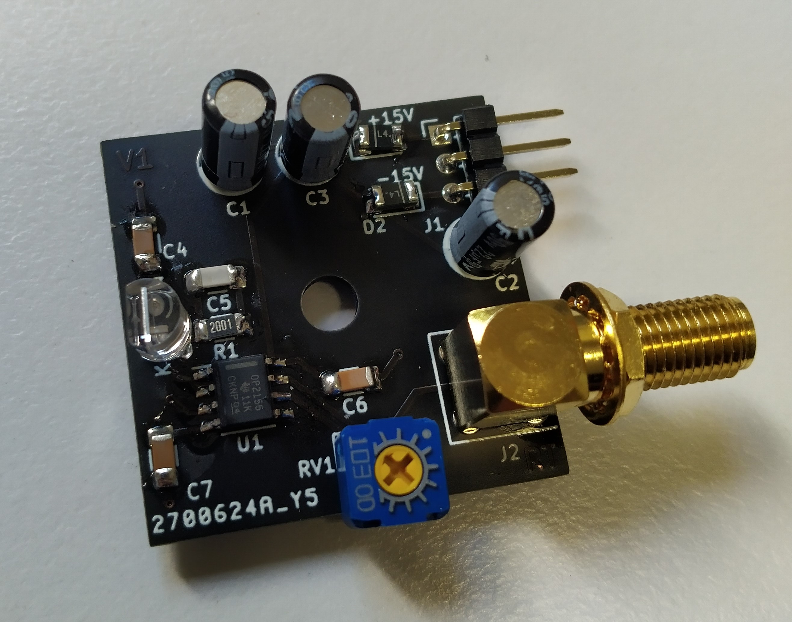
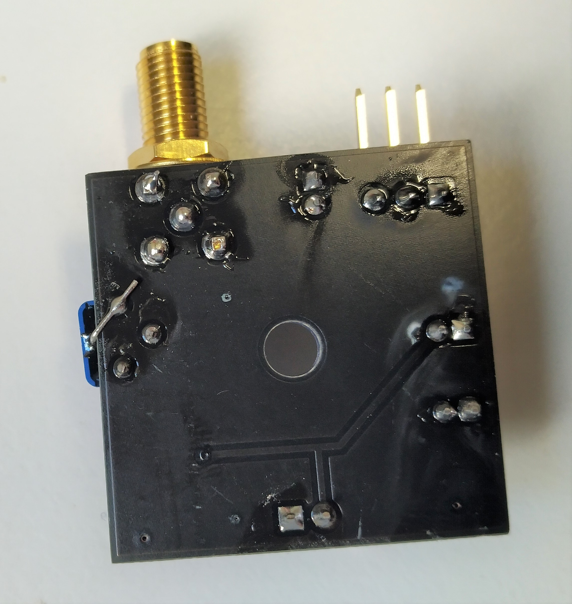
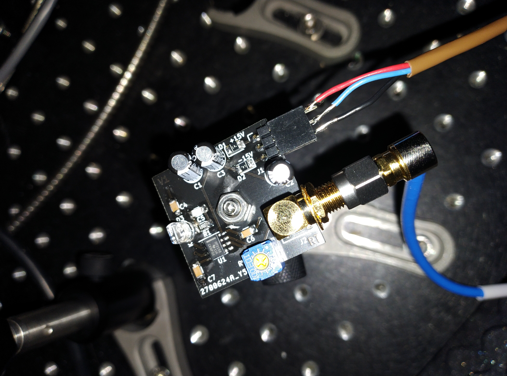

# Description

A simple photodetector design for relatively low bandwidth detection of optical signals.  The operator supplies anywhere between +/-5 V to +/-18 V to the three-pin male header, and these input voltages are filtered by a few 22 uK capacitors.  The negative voltage is used for reverse biasing the photodiode, and both polarities are used for powering the dual op-amp.  The photocurrent from the photodiode passes through a transimpedance amplifier with a bandwidth of about 4 MHz which produces 1 V for 1 mW of light at 780 nm.  A second stage of amplification using a non-inverting amplifier has adjustable gain.  The output voltage is accessible via an SMA connector.  The approximate cost per fully-assembled board is about $15, with $4 being the SMA connector.

The PCB is designed so that it can be attached to a standard Thorlabs 1/2" optical post by the central mounting hole.  

**Note** that the V1 design (as marked on the top-left of the board) has connected the potentiometer for the second gain stage incorrectly.  The center pin of the potentiometer needs to be connected to the left-most hole on the footprint.  

# Manufacturing and assembly

The project was designed in KiCAD, an open-source electronics schematic and PCB editor.  If you need to edit the files, you will need to download and install KiCAD.

PDF versions of the schematic and the PCB layout are available in the 'plots' directory.

Gerber files are in the 'generated' directory, and these can be sent to your PCB manufacturer of choice.  I have had good experiences with [JLC-PCB](https://jlcpcb.com/) out of China.  You can upload the Gerber .zip file directly.

A part list with Digikey part numbers is in the file 'simple-photodetector.txt'.  The quantities there are sufficient for construction 10 photo-detectors.  You will need to add an appropriate female 3-pin header if that is how you want to connect power (such as Digikey part number 2057-RS1-03-G-ND).  An HTML page that you can open in your web-browser provides a list of Digikey part numbers and part references that you can have displayed when assembling.

The PCB footprints have been designed so that parts can be soldered onto the PCB by anyone with a modicum of skill in soldering.  Note that the orientation of the photo-diode is that the active area faces away from the board.  The op-amp used in this design has a white marker indicating the "front" of the chip, and this should be aligned with the extended white line on the op-amp footprint.  A correctly assembled board is shown below.

With the potentiometer in the position as seen in the above image, the second gain stage has a gain of 1 and thus acts only as a buffer.

The potentiometer RV1 was incorrectly set in the schematic for a non-inverting amplifier.  If you solder it as would normally be done without bending any pins, it will function as a buffer only with no gain.  To get it to work as a proper non-inverting amplifier, you will need to rotate the potentiometer part 90 degrees counter-clockwise, and then bend one of the pins around the board and solder it to the corresponding hole; see below image.

The photodetectors can be attached to a standard Thorlabs 1/2" post.  Power can be delivered by soldering the power supply connectors to a 3-pin female header.  An assembled, mounted, and powered board looks like the below image:

